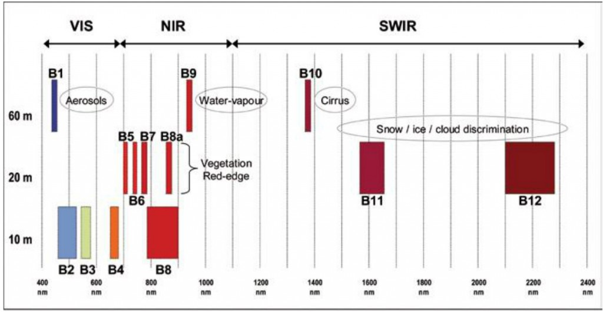

# GEOL0069 AI4EO
# Sentinel-2 Water Body Detection using NDWI, MNDWI, and K-means Clustering

## Overview

This project aims to detect and classify inland water bodies in China's **Yangtze River Delta (Taihu Lake)** and **Pearl River Delta (Zhujiang River)** regions using Sentinel-2 imagery. The workflow integrates spectral indices (NDWI, MNDWI) with unsupervised **K-means clustering** to improve water extraction accuracy.

## Objectives

- Extract surface water from Sentinel-2 images using NDWI and MNDWI
- Apply K-means clustering on spectral bands and indices to classify water/non-water areas
- Compare classification results with NDWI baseline masks

---
## Background

Inland water bodies—including lakes, rivers, reservoirs, and temporary wetlands—are vital to both natural ecosystems and human development. They influence regional hydrology, biodiversity, and land use patterns, and are closely tied to agriculture, industry, and urbanization. However, their dynamic nature makes them sensitive to environmental shifts and anthropogenic disturbance. Accurately identifying and monitoring these water bodies is essential for managing resources and assessing ecological risks.

Satellite-based Earth observation provides a practical and scalable solution for water body detection. Unlike traditional field surveys, remote sensing offers high temporal frequency, broad spatial coverage, and reduced cost. In particular, the Sentinel-2 mission delivers multispectral imagery at 10–20 meter resolution, making it well-suited for water extraction tasks.

This project explores a combined approach using spectral indices **(NDWI, MNDWI)** and unsupervised learning (K-means clustering) to detect surface water from Sentinel-2 data. By applying this method to the Yangtze River Delta and the Pearl River Delta—two hydrologically significant regions in China—we aim to evaluate its effectiveness and adaptability for inland water mapping.

### Region chosen reason
The Yangtze River Delta and the Pearl River Delta were selected as study areas due to their ecological, hydrological, and socio-economic significance. Both regions are characterized by dense river networks, extensive floodplains, and seasonal water fluctuations. They also represent typical examples of urban–water interface zones where human activities strongly interact with natural water systems.

The Yangtze River Delta (including areas like **Taihu Lake**) is one of the China’s largest freshwater lake region and plays a key role in flood control and biodiversity conservation. Meanwhile, the Pearl River Delta (including the **Southern parts of Guangzhou**) is one of the most economically developed and urbanized zones in China, where urban expansion often threatens natural wetlands.

By comparing these two contrasting yet complementary regions, this study aims to assess the robustness and adaptability of water detection methods across varying land use types, vegetation cover, and water body characteristics.

---
## Data

### Satellite-Sentinel-2 MSI 
Sentinel-2 is a twin-satellite mission developed by the European Space Agency (ESA) as part of the Copernicus Programme, aimed at providing high-resolution optical imagery for land monitoring. The mission consists of Sentinel-2A and Sentinel-2B, launched in 2015 and 2017 respectively, working in tandem to achieve a revisit time of 5 days at the equator.

Sentinel-2 carries the **MultiSpectral Instrument (MSI)**, which captures images in 13 spectral bands ranging from visible to shortwave infrared (SWIR), with spatial resolutions of 10 m, 20 m, and 60 m depending on the band. This makes it particularly suitable for applications such as vegetation monitoring, land use classification, urban mapping, and surface water body detection.

The availability of free and open-access data, frequent revisit times, and consistent spectral characteristics make Sentinel-2 an ideal data source for large-scale and time-sensitive remote sensing tasks.

### 📦 Data Source 

The Sentinel-2 satellite imagery used in this project was obtained from the  
**[Copernicus Open Access Hub](https://scihub.copernicus.eu/)**, the official data distribution platform under the European Union’s Copernicus Programme.

| Name | High-level Description | Production & Distribution |Data Volume|
|-----|-----|-----|-----|
| Level-1C  | BTop-of-atmosphere reflectances in cartographic geometry     | Systematic generation and on-line distribution   |600 MB (each 100x100 km2)|
| Level-2A  | Systematic generation and on-line distribution and generation on user side (using Sentinel-2 Toolbox)   | Systematic generation and on-line distribution and generation on user side (using Sentinel-2 Toolbox)   |800 MB (each 100x100 km2)

All data are free and open-access, provided by the **European Space Agency (ESA)** for scientific and operational use. The datasets used for this project are Sentinel-2 L2A datasets.
- **Bands used**:
  - B3 (Green, 10m)
  - B8 (NIR, 10m) – for NDWI
  - B11 (SWIR, 20m resampled to 10m) – for MNDWI
- **Regions of Interest**:
  - Yangtze River Delta (Taihu Lake area)
  - Pearl River Delta (Zhujiang river / Guangzhou area)

The datasets used for this project can be find in with the name in [https://browser.dataspace.copernicus.eu](https://browser.dataspace.copernicus.eu)

-**Zhujiang** *S2A_MSIL2A_20250415T030151_N0511_R032_T49QGF_20250415T095813.SAFE*

-**Yangzijiang** *S2B_MSIL2A_20250512T023529_N0511_R089_T51RTQ_20250512T043829.SAFE*

---

## Methods

### 1. **NDWI (Normalized Difference Water Index)**

$$
\text{NDWI} = \frac{\text{Green} - \text{NIR}}{\text{Green} + \text{NIR}}
$$

NDWI (Normalized Difference Water Index) enhances water features by comparing reflectance in the green and near-infrared (NIR) bands. It was introduced by McFeeters (1996) to distinguish water from vegetation and soil.
- Used to generate binary water masks 

### 2. **MNDWI (Modified NDWI)**
$$
\text{NDWI} = \frac{\text{Green} - \text{SWIR}}{\text{Green} + \text{SWIR}}
$$

MNDWI (Modified NDWI), proposed by Xu (2006), replaces the NIR band with shortwave infrared (SWIR), making it more effective for detecting water in urban or turbid environments.
- More effective in urban or turbid areas

### 3. **K-means Clustering**
- Applied to:
  - Band combinations (e.g., Green + NIR or Green + SWIR)
  - MNDWI values
- Automatically labels pixels into water / non-water clusters
- Post-processing step flips labels based on NIR or MNDWI statistics

---
# Contact

Jianhong Zou - [zcfbjzo@ucl.ac.uk](zcfbjzo@ucl.ac.uk) 

Project Link: https://github.com/JianhongZou/GEOL0069

(<a href="#readme-top">back to top</a>)

## Acknowledgments
This project was created for GEOL0069 at University College London, taught by Dr. Michel Tsamados and Weibin Chen.

## Reference

**Instrument Payload*. (n.d.). Sentinel Online. [https://sentinels.copernicus.eu](https://sentiwiki.copernicus.eu/web/sentinel-2)*

*Unsupervised Learning — GEOL0069 Guide Book*. (n.d.). https://cpomucl.github.io/GEOL0069-AI4EO/Chapter1%3AUnsupervised_Learning_Methods.html

*McFeeters, S. K. (1996). The use of the Normalized Difference Water Index (NDWI) in the delineation of open water features. International Journal of Remote Sensing, 17(7), 1425–1432.*

*Xu, H. (2006). Modification of normalized difference water index (NDWI) to enhance open water features in remotely sensed imagery. International Journal of Remote Sensing, 27(14), 3025–3033.*
